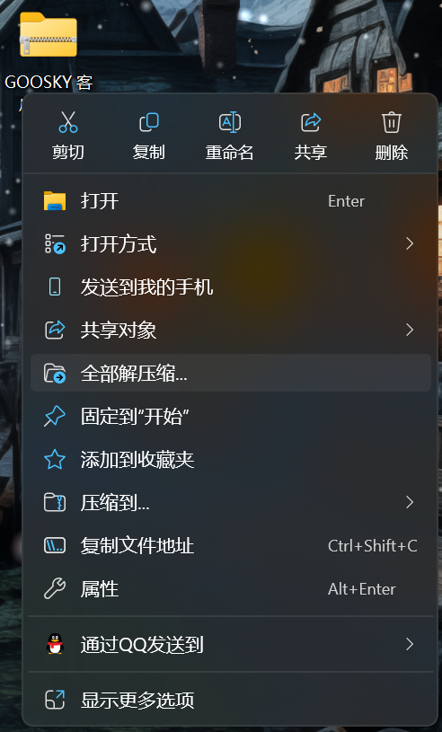

# 安装客户端

_<mark style="color:$info;">提示：如果你选择自己的1.21.5版本加入服务器，请跳过该步骤</mark>_

1.加入QQ群    [311329512](https://qm.qq.com/q/yyzbJlmG9G)

2.点击群文件

<figure><figcaption></figcaption></figure>

3.下载  <mark style="color:$success;">**GOOSKY客户端.zip**</mark>

&#x20;

<figure><figcaption></figcaption></figure>

<mark style="color:$primary;">推荐右键文件另存为到桌面<mark style="color:$primary;">

4.解压文件 （你完全可以使用自己的压缩软件进行解压）

右键下载好的文件，点击全部解压缩

<figure><figcaption></figcaption></figure>

点击提取即可

<figure><figcaption></figcaption></figure>
